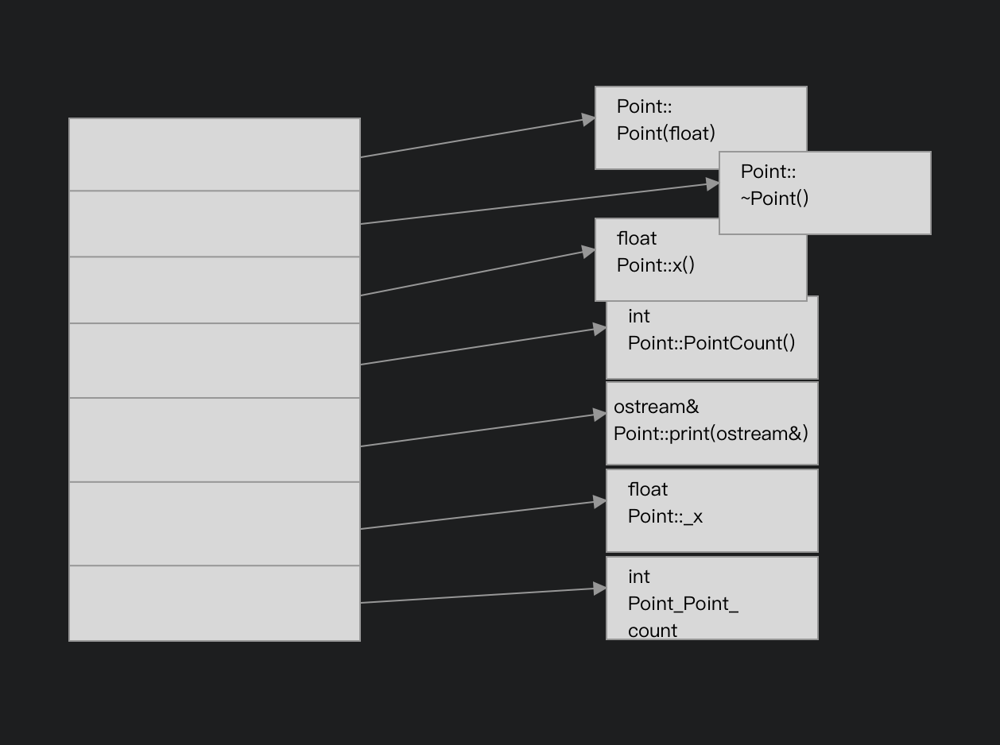
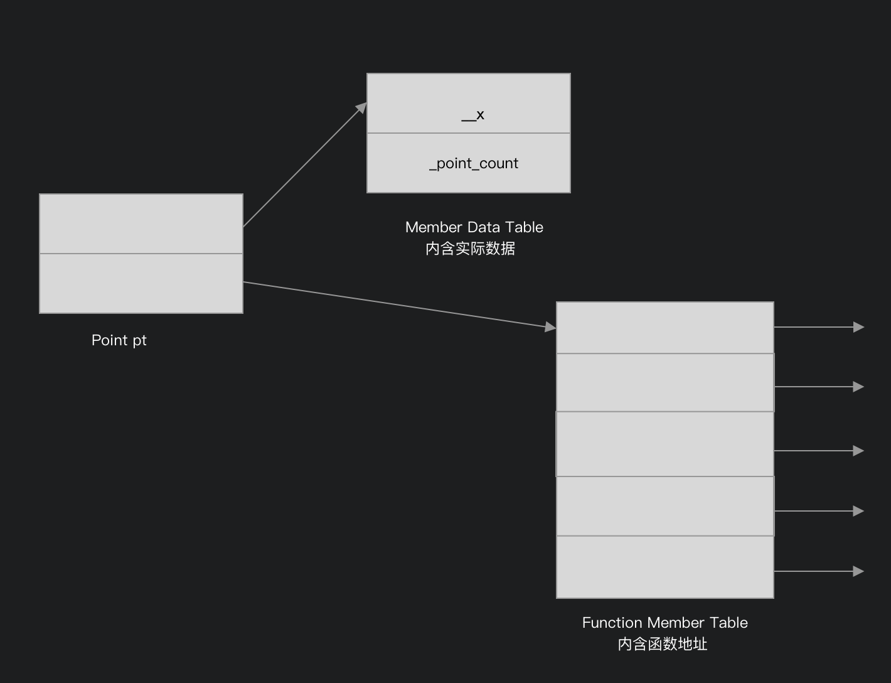
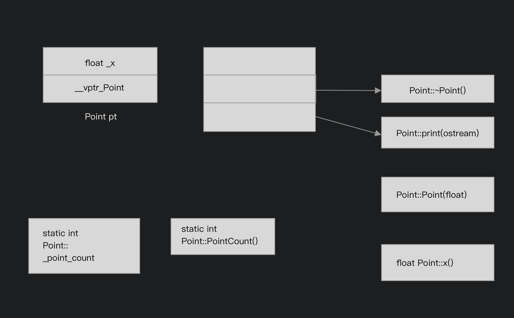

# C++对象模型

### 在c++中，有两种类数据成员：*static*和*nonstatic*，以及三种类成员函数：*static*，*nonstatic*和*virtual*

```cpp
class Point{
public:
    Point(float xval);
    virtual ~Point();

    float x()const;
    static int PointCount();
protected:
    virtual ostream&
        print(ostream &os)const;

    float _x;
    static int _point_count;
};
```

## 简单对象模型(A Simple Object Model)

### 以上这个模型十分简单。在这个简单模型中，一个object是一系列的slots，每一个slot指向一个members。Members按照声明顺序，被各指定一个slot。每一个data member或function member都有自己的一个slot。
如下图所示



在这个模型下，members本身并不放在object之中。只有指向member的指针才放在object内。这么做可以避免因为members有不同的类型，因而需要不同的存储空间所导致的问题。一个class object的大小很容易计算：指针大小xclass中所声明的members个数

这个模型并没有被应用于实际产品中。

## 表格驱动对象模型(A Table-driven Object Model)

### 把所有与members相关的信息抽出来，放在一个data member table和一个member function table之中，object本身则含有指向这两个表格的指针。



虽然这个模型也没有应用到真正到c++编译器上，但是这个member function table这个观念却成为支持virtual functions的一个有效方案。

## C++对象模型

最初的c++对象模型是从简单对象模型派生的。在此模型中，Nonstatic data members被配置于每一个class object之内，static data members则被存放在个别的class object之外。Static和nonstatic function members也被放在个别class object之外。virtual function遵循以下两个步骤：

### 1.每一个class产生出一堆指向virtual functions的指针，放在表格之中。这个表格被称为virtual table(vtbl)。
### 2.每一个class object被安插一个指针，指向相关的virtual table。通常这个指针被称为vptr。vptr的设定(setting)和重置(resetting)都由每一个class的constructor、destructor和copy assignment运算符自动完成。

